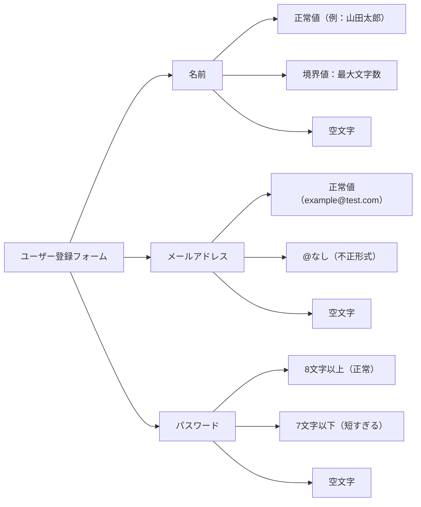

# クラシフィケーションツリー技法

**クラシフィケーションツリー技法**（Classification Tree Technique）とは、テスト対象の入力パラメータ（分類）とその値（クラス）をツリー構造で整理し、テストケースを網羅的・効率的に設計するブラックボックステスト技法です。JSTQB AL TAシラバスv3.1.1（3.2.5節）に定義されています。

## 構成要素

| 要素 | 説明 |
|------|------|
| **分類（Classification）** | テストに影響するパラメータ・観点（例：OS、ブラウザ、入力値の種別） |
| **クラス（Class）** | 各分類が取りうる値・区分（例：Windows / Mac / Linux） |
| **ツリー構造** | 分類を階層的に整理したもの。ルートがテスト対象、葉ノードがクラス |
| **テストケース** | ツリーの各分類から1つずつクラスを選んだ組み合わせ |

## ツリーの構造

```
テスト対象
├── 分類A
│   ├── クラスA1
│   └── クラスA2
├── 分類B
│   ├── クラスB1
│   ├── クラスB2
│   └── クラスB3
└── 分類C
    ├── クラスC1
    └── クラスC2
```

全組み合わせ数 = 2 × 3 × 2 = **12通り**

## 例：Webフォームの入力テスト

対象：ユーザー登録フォーム（名前・メールアドレス・パスワード）



全組み合わせ：3 × 3 × 3 = **27通り**

## クラシフィケーションツリーとオールペアの組み合わせ

全組み合わせをテストするのが困難な場合、**ペアワイズ法（オールペア）** と組み合わせて使用します。

| アプローチ | テストケース数 | カバレッジ |
|-----------|--------------|----------|
| 全組み合わせ | 27通り | 全パターン網羅 |
| ペアワイズ（オールペア） | 9通り程度 | 任意の2分類の組み合わせを網羅 |

> クラシフィケーションツリーで**何をテストするか**を整理し、オールペアで**テストケース数を削減する**という組み合わせが効果的です。

## 同値クラスとの関係

各クラスは**同値パーティション**（同じ振る舞いをするグループ）に対応します。クラシフィケーションツリーは同値分割・境界値分析と組み合わせて使うことで、より精度の高いテストケースを設計できます。

| テスト技法 | 役割 |
|-----------|------|
| クラシフィケーションツリー | パラメータと値を整理・可視化する |
| 同値分割 | 各クラスの代表値を決定する |
| 境界値分析 | クラスの境界付近の値を追加する |
| ペアワイズ | 組み合わせ数を最小化する |

## テスト設計の手順

1. **テスト対象を分析**し、影響する入力パラメータ（分類）を洗い出す
2. 各分類に対して**クラス（値の区分）** を定義する（同値分割を活用）
3. 分類と階層関係をツリーとして**図示**する
4. カバレッジ基準に応じてテストケースを**組み合わせる**（全組み合わせ or ペアワイズ）
5. 各テストケースに**期待結果**を記述する

## 利点と注意点

**利点**
- テスト設計の抜け漏れを視覚的に発見しやすい
- チーム内でテスト観点を共有しやすい
- ペアワイズと組み合わせることでテストケース数を効率的に削減できる

**注意点**
- 分類の粒度が粗すぎると重要なケースを見逃す
- 分類間に依存関係がある場合（例：OS が Windows のときのみ有効な設定）は、無効な組み合わせを除外する必要がある
