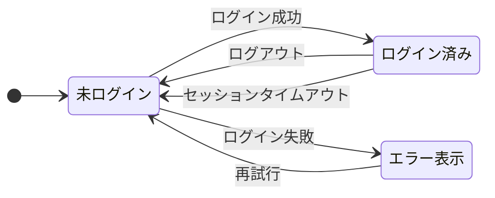
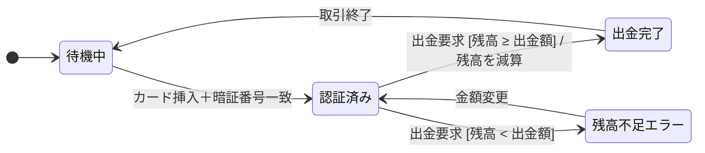

# 状態遷移図

**状態遷移図**（State Transition Diagram）とは、システムやオブジェクトが取りうる**状態**と、状態間の**遷移**をグラフィカルに表現した図です。状態遷移テストのテストケース設計における基盤となります。

## 構成要素

| 要素 | 記法 | 説明 |
|------|------|------|
| **初期状態** | 黒丸 → 状態 | システム起動時の開始点 |
| **状態（State）** | 角丸の四角形（ノード） | システムが特定の時点でとる安定した条件や状況 |
| **遷移（Transition）** | 矢印（エッジ） | ある状態から別の状態への変化 |
| **イベント（Event）** | 矢印のラベル（上段） | 遷移を引き起こすきっかけ（例：ボタンクリック、タイムアウト） |
| **ガード条件（Guard）** | 矢印のラベル（`[条件]`） | 遷移が発生するために満たすべき条件 |
| **アクション（Action）** | 矢印のラベル（`/ 処理`） | 遷移時に実行される処理 |
| **終了状態** | 二重丸 | システム終了・処理完了の終端 |

## 例：ログイン機能の状態遷移図



| 現在の状態 | イベント | 次の状態 | アクション |
|-----------|---------|---------|-----------|
| 未ログイン | ログイン成功 | ログイン済み | セッション生成 |
| 未ログイン | ログイン失敗 | エラー表示 | エラーメッセージ表示 |
| エラー表示 | 再試行 | 未ログイン | エラーリセット |
| ログイン済み | ログアウト | 未ログイン | セッション削除 |
| ログイン済み | タイムアウト | 未ログイン | セッション削除 |

## ガード条件（Guard Condition）

**ガード条件**とは、遷移が実行される際に**満たされなければならない条件**です。同じイベントが発生しても、ガード条件の真偽によって遷移先が変わる（または遷移が発生しない）ため、条件分岐を伴うビジネスロジックの表現に使います。

記法：`イベント [条件] / アクション`

### イベントとの違い

| | イベント | ガード条件 |
|---|---|---|
| **役割** | 遷移を引き起こすきっかけ | 遷移の実行可否・遷移先を決める条件 |
| **記法** | 矢印ラベルの主部 | `[...]` で囲む |
| **評価タイミング** | 外部から発生するトリガー | イベント発生時にシステムが評価する |
| **例** | `出金要求` | `[残高 ≥ 出金額]` |

### 具体例：ATM の出金フロー

「出金要求」という**同じイベント**が発生しても、残高条件の真偽によって遷移先が分岐します。



| 現在の状態 | イベント | ガード条件 | 次の状態 | アクション |
|-----------|---------|----------|---------|-----------|
| 認証済み | 出金要求 | 残高 ≥ 出金額 | 出金完了 | 残高を減算 |
| 認証済み | 出金要求 | 残高 < 出金額 | 残高不足エラー | エラーメッセージ表示 |
| 残高不足エラー | 金額変更 | —（条件なし） | 認証済み | — |

イベントは同じ「出金要求」ですが、ガード条件の真偽によって遷移先が「出金完了」か「残高不足エラー」に分かれます。

### ガード条件のテストケース設計

ガード条件がある遷移では、条件が**真（True）の場合と偽（False）の場合の両方**をテストします。境界値分析と組み合わせると、`≥` と `>` の実装ミスなど境界付近のバグも検出できます。

| テストケース | 残高 / 出金額 | ガード評価 | 期待する遷移先 |
|------------|-------------|----------|-------------|
| 残高が十分 | 1,000円 / 500円 | 1000 ≥ 500 → **真** | 出金完了 |
| 残高が不足 | 300円 / 500円 | 300 ≥ 500 → **偽** | 残高不足エラー |
| 境界値（等しい） | 500円 / 500円 | 500 ≥ 500 → **真** | 出金完了 |
| 境界値のすぐ外 | 499円 / 500円 | 499 ≥ 500 → **偽** | 残高不足エラー |

### 変数をガード条件に使う例

ガード条件には、システム内部の変数を使うこともできます。保険請求システムの例を以下に示します。

| イベント | ガード条件 | 遷移 | 意味 |
|---------|----------|------|------|
| goBack | `[x == acc]` | Closed → Accepted | `acc`（Accepted からクローズ）の場合、Accepted に戻る |
| goBack | `[x == act]` | Closed → Activated | `act`（Activated からクローズ）の場合、Activated に戻る |

同じ Closed ステートからの `goBack` イベントでも、変数 x の値によって遷移先が変わります。この場合、x の値ごとに**別々のテストケース**が必要です。

> **ポイント**：ガード条件の数だけ遷移先が増えます。遷移カバレッジ（0スイッチ）を達成するには、各ガード条件が真になるテストケースを少なくとも1件ずつ用意する必要があります。

## 状態遷移表との関係

状態遷移図を表形式にしたものが**状態遷移表**です。  
図は全体の流れを把握しやすく、表は網羅性の確認（テストケース漏れの検出）に優れています。両方を併用するのが効果的です。

## カバレッジ基準

| 基準 | 別名 | 説明 | テストケース数の目安 |
|------|------|------|-------------------|
| **全状態カバレッジ** | — | 全ての状態を少なくとも1回通過する | 少ない |
| **全遷移カバレッジ** | **0スイッチカバレッジ** | 全ての遷移（矢印）を少なくとも1回通過する | 中程度 |
| **全遷移ペアカバレッジ** | **1スイッチカバレッジ** | 連続する2つの遷移の全組み合わせを網羅する | 多い |

JSTQB AL TAのシラバスでは、**全遷移カバレッジ（0スイッチ）** の達成が推奨されています。

## 0スイッチと1スイッチ

**Nスイッチカバレッジ**とは、連続するN+1個の遷移の全組み合わせをカバーするという考え方です。

### 0スイッチカバレッジ（全遷移カバレッジ）

すべての**個別の遷移**を少なくとも1回実行します。

ログイン機能の例では、以下の5遷移を全てカバーするテストケースが必要です。

| # | 遷移 | テストシナリオ例 |
|---|------|----------------|
| T1 | 未ログイン → ログイン済み | 正しい認証情報でログイン |
| T2 | 未ログイン → エラー表示 | 誤った認証情報でログイン |
| T3 | ログイン済み → 未ログイン | ログアウトボタンを押す |
| T4 | ログイン済み → 未ログイン | 一定時間操作せずタイムアウト |
| T5 | エラー表示 → 未ログイン | エラー画面から再試行 |

最低3テストケースで全5遷移をカバーできます。

```
TC1: [開始] → T1（ログイン成功） → T3（ログアウト）
TC2: [開始] → T1（ログイン成功） → T4（タイムアウト）
TC3: [開始] → T2（ログイン失敗） → T5（再試行）
```

### 1スイッチカバレッジ（全遷移ペアカバレッジ）

連続する**2つの遷移の組み合わせ**を全てカバーします。0スイッチより多くの欠陥（特定の遷移の後にのみ発生する不具合）を検出できます。

ログイン機能での遷移ペア一覧：

| 遷移ペア | シナリオ |
|---------|---------|
| T1 → T3 | ログイン成功 → ログアウト |
| T1 → T4 | ログイン成功 → タイムアウト |
| T2 → T5 | ログイン失敗 → 再試行（→ 未ログインへ戻る） |
| T3 → T1 | ログアウト後 → 再ログイン成功 |
| T3 → T2 | ログアウト後 → ログイン失敗 |
| T4 → T1 | タイムアウト後 → 再ログイン成功 |
| T4 → T2 | タイムアウト後 → ログイン失敗 |
| T5 → T1 | 再試行後 → ログイン成功 |
| T5 → T2 | 再試行後 → ログイン失敗 |

> **0スイッチと1スイッチの選択基準**：リスクが低いシステムは0スイッチ、ログインや決済など状態依存のバグが起きやすい機能は1スイッチが推奨されます。

## テスト設計への活用

1. 状態遷移図（または遷移表）を作成する
2. カバレッジ基準を決める（例：全遷移カバレッジ）
3. 各遷移を1回以上通過するテストシナリオを設計する
4. **無効な遷移**（仕様上存在しない遷移）も否定テストとして追加する

> **ポイント**：状態遷移テストは、ログイン・注文フロー・デバイスの動作モードなど、**有限の状態を持つ系**に対して特に効果的です。
