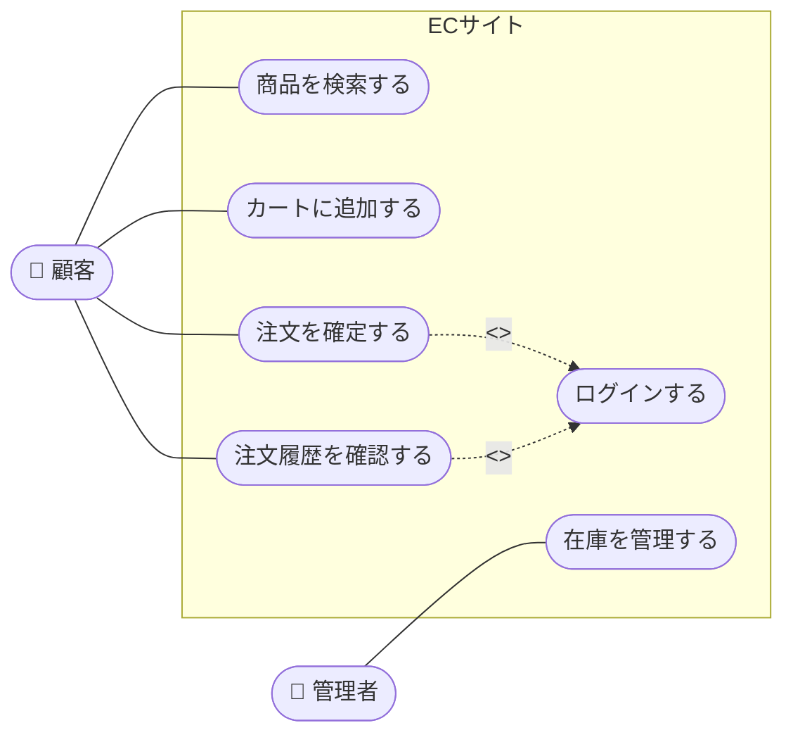

# ユースケース図

**ユースケース図**（Use Case Diagram）とは、システムが提供する機能（ユースケース）と、それを利用するアクター（人・外部システム）の関係を視覚的に表現したUML図です。ユースケーステストのテストケース設計における基盤となります。

## 構成要素

| 要素 | 記法 | 説明 |
|------|------|------|
| **アクター（Actor）** | 棒人間 | システムを利用する人・外部システム・デバイス |
| **ユースケース（Use Case）** | 楕円 | システムが提供する機能・サービス |
| **システム境界** | 四角い枠 | テスト対象システムの範囲 |
| **関連（Association）** | 実線 | アクターとユースケースの利用関係 |
| **汎化（Generalization）** | 白抜き矢印 | アクター同士・ユースケース同士の継承関係 |
| **包含（`<<include>>`）** | 点線矢印 | 必ず実行される共通処理への参照 |
| **拡張（`<<extend>>`）** | 点線矢印 | 条件付きで追加される処理への参照 |

## 包含と拡張の違い

| | `<<include>>` | `<<extend>>` |
|---|---|---|
| **実行タイミング** | 常に実行される | 条件を満たした場合のみ実行 |
| **依存の方向** | 基本ユースケース → 共通処理 | 拡張ユースケース → 基本ユースケース |
| **典型例** | ログイン確認、ログ記録 | エラーメッセージ表示、プレミアム機能 |

## 例：ECサイトの注文機能

## テスト設計への活用

ユースケース図からテストケースを設計する際は、以下の流れで進めます。

### 1. 基本フロー（Basic Flow）のテスト

ユースケースが正常に完了する最も一般的なシナリオをテストします。

| ユースケース | 基本フロー例 |
|------------|------------|
| 注文を確定する | ログイン → 商品選択 → カート追加 → 支払い入力 → 注文完了 |

### 2. 代替フロー（Alternative Flow）のテスト

基本フローとは異なる正常な経路をテストします。

| ユースケース | 代替フロー例 |
|------------|------------|
| 注文を確定する | ゲスト購入（ログインなし）で注文完了 |

### 3. 例外フロー（Exception Flow）のテスト

エラーや異常が発生した場合の振る舞いをテストします。

| ユースケース | 例外フロー例 |
|------------|------------|
| 注文を確定する | 支払いエラー → エラーメッセージ表示 → 再入力 |
| 注文を確定する | 在庫切れ → 購入不可メッセージ表示 |

### 4. `<<include>>` / `<<extend>>` のテスト

| 関係 | テスト観点 |
|------|----------|
| `<<include>>` | 共通処理（ログイン等）が必ず呼び出されているか |
| `<<extend>>` | 拡張条件が成立する場合・しない場合の両方をテストする |

## カバレッジ基準

| 基準 | 説明 |
|------|------|
| **基本フローカバレッジ** | 全ユースケースの基本フローを1回以上実行する |
| **全フローカバレッジ** | 基本・代替・例外フローを全てカバーする |
| **アクターカバレッジ** | 全アクターがそれぞれの操作を1回以上実行する |

> **ポイント**：ユースケーステストは、ユーザー視点のエンドツーエンドシナリオを設計しやすく、**システムテストや受け入れテスト**の段階で特に効果的です。
